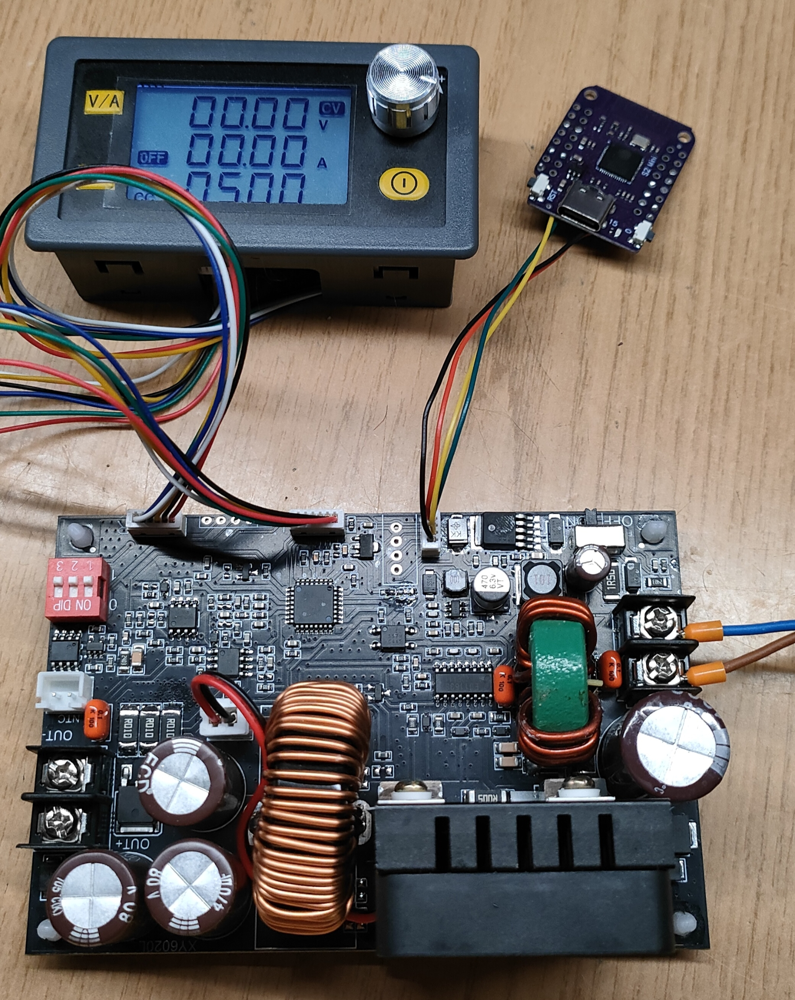

# Подключаем модуль xy6020l к ESPHome для создания продвинутого БП

 

Для одного проекта мне понадобился достаточно мощный БП способный выдавать напряжение в районе 40В и достаточно большой ток, мой выбор пал на данный модуль, который в пике позволяет выдавать мощность до 1200Вт.

**xy6020l** - это очень интересный и функциональный модуль, в Интернете есть много его обзоров и описаний.

Возможность дистанционного управления стала для меня приятной неожиданностью и с помощью группы экспертов GPT :) быстро была создана данная прошивка.

Данный модуль позволяет управлять собой по протоколу Modbus. А так как на нём выведены UART контакты Rx и Tx, то и подключиться к нему можно напрямую, без RS485.

К сожалению возможности работы esphome с modbus находятся в достаточно зачаточном состоянии :(
